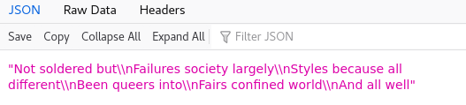

# Queer Motto API Manual

<p>


## Project title
Queer Motto API: To know exactly how many times to cry

**Description:**

“Queer Motto API” software-as-service lets you develop websites and applications to retrieve and display allied mottos, for urban dreams lying in wait, anti-facist guiding principles of living, queer love ethics, authoritarian resistances, unsettle normative computational culture, revolutions, political movements, destruction of smart city infrastructures, class struggles, municipal identities, art practices, joyful engagements and violent direct action.

Our mandate:
* undisciplined and vulnerable,
* reorganise your collective life and fight injustices in the present,
* NAP and be RESTful,
* render computers unusable,
* refuse tokenisms,
* (re)externalise risks,
* make use of accident and injury,
* networks of pleasure,
* launch relentless attacks.

ALL ACCUMULATED & QUE(E)RY IN REALTIME PROGRAMATICALLY.

Thank you; have a nice day!

## Examples of allied mottos

Generated from the Queer Motto API:


<br>


```html
Not soldered but
Failures society largely
Styles because all different
Been queers into
Fairs confined world
And all well
```

## NAPPY API Specification - r1

**USAGE:**
```html
https://toknowexactlyhowmanytimestocry.net/queermottoAPI/r1/refusal?
rq=generate&org=refuse-tokenisms-tt-2021
```

**NOTES:**
1. Any incompleted parameters/values will result in generating refusal code and messages.
2. The parameter of `org` is the key authetication parameter, and the example above is for TESTING only.
3. Please contact us for the new `org` value if you want to use this NAPPY API in your projects or organizations.

### Parameters

| Parameters | Value(s) | Description
| -------- | -------- |-------- |
| rq   | 'generate', 'motto_log', 'all_log'  | request type
| org   | *pls contact us for this*   |A unique identity for each organization/user to `generate` mottos <e.g xxxxxxx-xxxxxxxxx-xx-xxxx>|

### Parameter: rq

`rq`  
string  
REQUIRED

**Request types:**

| Value | Description |
| -------- | -------- |
| `generate`    | a new motto request  |
| `motto_log`   | retrieve all the generated mottos   |
| `all_log`   | retrieve all the generated mottos and refusal records|

**NOTE:**

1. Any incompleted parameters/values will result in generating refusal code and messages.

### Parameter: org

`org`  
string  
REQUIRED

> A unique identity for each organization/user to `generate` mottos <e.g xxxxxxx-xxxxxxxxx-xx-xxxx>.

**NOTE:**
1. Please contact us for the org value if you want to use this NAPPY API
2. Any incompleted parameters/values will result in generating refusal code and messages.

### API Response

`200 application/json`

The API returns a JSON file.

**EXAMPLE:**

#### 1. when `rq=generate` (with a valid org value):

**Returned format:** JSON

**Description:** Return an allied motto

```json
"Names to activities\\nForce rotation World\\nSharing female culture profound\\nBe survival after\\nFact today world\\nAre plants political"
```
After parsing it will read as:

```html
Names to activities
Force rotation World
Sharing female culture profound
Be survival after
Fact today world
Are plants political
```

**NOTE:**

*To use the generated text, your end (at the program level) can parse the delimiter `\\n` in which it signifies the next line of the motto.*

#### 2. **when `rq=motto_log`:**

**Returned format:** JSON

**Description:** Return all the generated allied mottos.

**USAGE:**

```html
https://toknowexactlyhowmanytimestocry.net/queermottoAPI/r1/refusal?rq=motto_log
```

**EXAMPLE:**


| Field | Description           |
| -------- | --------           |
| 0    | Generated mottos       |
| 1    | Timestamp (CET time)   |
| 2    | Organizational name    |
| 3    | Seed Text              |

---
#### 3. **when `rq=all_log` :**

**Returned format:** JSON

**Description:** Return all the logs from the server, including various request types, the generated mottos and refusal messages.

**USAGE:**

```html
https://toknowexactlyhowmanytimestocry.net/queermottoAPI/r1/refusal?rq=all_log
```

**EXAMPLE:**


| Field | Description |
| -------- | --------           |
| 0    | Generated mottos       |
| 1    | Timestamp (CET time)   |
| 2    | Organizational name    |
| 3    | Seed Text              |
| 4    | Refusal code           |
| 5    | Refusal message        |
| 6    | Request type - 'unknown', 'generate', 'motto-log', 'all_log' |

## Queer Motto API


### 1. Queer Motto Alliance

The project primarily includes two parts: the generative allied mottos and the refusal messages.

The generative mottos are based on manifestos and zines for queer and intersectional life as source text for machine learning and generative processes. The project uses recurrent neural networks to train and process sequences of collective voices, as well as the diastic algorithm to establish a poetic structure. 

API's violently arrange life, rendering it portable, modular and as a resource to profit from. It is not the stack that we need to rise up and fight against but the web of API's that stretch from the streets to the sheets. Gam$zon are using their compute power to become the one who make all decisions for life from how they store data about our streets to who decides and recommends who we love and desire - "we refuse this and we are an army of lovers because it is we who know what love is. Desire and lust, too. We invented them (Act up 1990)". With the Queer Motto API we make the source code available and offer to share our compute with you. We invite users & requesters to think about how we can imagine refusal strategies against Big Tech, normative API life and cloud computing--to address the huge inequalities presented by who has the right and resources to compute and to tactically multiply the possibilities for living.

The program also implements computational logics to perform refusal at the infrastructural level, generating refusal messages that are found in our list of queer and intersectional source text.

### 2. Generative propositions 

<a href="http://siusoon.net/projects/finiteState_gallery_T2a_neato.svg" target="_blank">
</a>

Queer Motto API uses a RESTful architecture that is built from manifestos and zines for queer, Black, Asian and intersectional life as source text for machine learning and generative processes. Queer Motto API contantly listens for Motto requests. The Mottos are generated through the mis/use of AI-specifically recurrent neural networks - a machine learning model which the Queer Serivce team use to train and process sequences of collective voices. The machine learning algorithm learns its writing style at a character-based level, however instead of a single authorial voice the model is trained on an alliance of queer writers. 

This queer model opens up new imaginaries and forgotten language beyond the confines of accurate prediction and effective generalization. We understand this type of machine learning as replacing training with listening. A listening which as Kara Keeling describes is a “generative proposition another world is possible, the insistence that such a world already is here now and it listens, with others, for the poetry, poetry, the refrains, the rhythms, and the noise such a world is making”. (2019, ix)

The mottos are written using a "[diastic reading through](https://poetrydish.blogspot.com/2009/02/forms-of-poetry-diastic.html)" method a chance based deterministic method that relies on the use of two texts:


**Source Text**

To gather the inital collection for the source text the queer service team went urban dreaming, seeking out manifestos that are housed in the radical books shops and libraries in Kings Cross and Euston, places that are historically important for the queer movement. Although sites of historic significance for queer spaces, Kings Cross and Euston are both areas that have been effected significantly by the construction and changing urban fabric of London: Queer night-time spaces have been replaced by the relentless gentrification by tech companies and start-ups. The source text is an growing collection and manifestos can be proposed and entered into the model's listening.

**Seed Text**

The seed text "Not for Self, but for All" is used in different parts of the text generation. This seed text, which at first was mistaken for a corporate slogan, is Camden Council’s motto for their municipal identity which hangs prominently next to the Google offices in the heart of the new development of Kings Cross. Recurrent Queer Imaginaries is a call to reclaim queer spaces from corporate neocolonial imaginations, operational injustices and reimagine them differently for all, as a commitment to queer liberation.

The motto's are generated from the machine learning model using the diastic algorithm and seed text to write through the source text. 

### 3. Refusal logic


| Code   | Description |
-------- | ----------- |
| 400   | A refusal word is found in the generated motto |
| 401   | Infrastructure  & technical issues   |
| 402   | Every n API request counts & on specific nap dates   |

There are three levels of refusal logic that point to different living conditions and open up other ways of being and actions. For the refusal code 400, it makes explicit [what](/queerapi_src/refused_words.py) to refuse, such as "hate", "oppression" and "foreclosing" to consider wider injustice phenomena. Refusal code 401 is more related to infrastrucure and technical issues, such as incompleted API parameters, server errors and connection problems, and these remind the effort and care that are required to maintain a technocultural system. The last refusal code 402 points to labour conditions, and encourages others to take naps and live restfully. The API will refuse to generate mottos when it exceeds the assigned count (which is 10 at the moment) of the API requests, as well as on specific dates, such as 9th of March (Women's strike), 1st of May (Labour strike), and 20th Jul (Strike for Black Lives). With all these checking logics, a refusal message will be displayed instead of a motto.

[The refusal messages](/queerapi_src/refusal_messages.py) are actions and statements that are taken from the queer and feminist source text. They are not tehnical errors, but call for an attention to our living and societal conditions, that are highly computational, resource-driven and stressful, and to rethink what and why to refuse, and how we might reorganize and queer our collective life -- a form of society-level operating system. As elaborated by Kara Keeling, this form of queer operating system service "facilitates and supports imaginative, unexpected, and ethical relations between and among living beings and the environment" (2014, 154).

**EXAMPLE OF A REFUSAL MESSAGE:**

Your motto request is refused. REFUSAL " + refusal_code +": " + "REFUSAL CONTENT in the form of an random array index"


## Server info & Tech spec
- Debian ver 10
- Web server Nginx (nginx-1.14.2)
- Flask Python 
- [Text Predictor](https://github.com/gsurma/text_predictor) by Greg Surma (Python, TensorFlow and RNN)
- SQLite (SQLite version 3.27.2)
- Source code [link](https://gitlab.com/siusoon/queer-motto-api/-/tree/master/queerapi_src)

## License

The project is licensed under a Collective Conditions for Re-Use (CC4r)

See more: https://gitlab.constantvzw.org/unbound/cc4r

## All Manifestos

* 80:20 (2011) by Lucia Tkacova and Anetta Mona Chisa
* 100 ANTI-THESES (1997) by Old Boys Network
* 100 IMPOSSIBLE ARTWORKS (2001) by Dora Garcia
* A CYBORG MANIFESTO (extract) (1991) by Donna Haraway
* ARCHIVAL PRAXIS (2013) by Jean Carlomusto
* A STATEMENT OF OUTRAGE AGAINST AMERICAN ASSIMILATIONISTS WHO PRACTICE APPEASEMENT OF HETERO TERROR IN THE WAKE OF A.I.D.S GENOCIDE IN THE UNITED STATES (2013) by Jerry Tartaglia, 2013.
* BEYOND DOMESTICATION (2013) by Richard Fung
* BITCH MUTANT MANIFESTO (1996) by VNS Matrix
* CYBERFEMINIST MANIFESTO FOR THE 21ST CENTURY (1991) by VNS Matrix (Josephine Starrs, Julianne Pierce, Francesca Da Rimini, Virginia Barratt)
* ECOSEX MANIFESTO (2011) by Elizabeth M. Stephens and Annie M. Sprinkle
* FEMINIST ART ACTION BRIGADE - MANIFESTO (2003) by Feminist Art Action Brigade (FAAB)!
* FEMINIST NOSIFICATION OF SOCIAL MEDIA (2019) by Purple Noise
* FOR HEAT AND LIGHT AND OUTRAGEOUSNESS (2013) by B. Ruby Rich.
* INTRODUCTORY RANT IN PERFORMANCE OF ASSISTED LIVING: DO YOU HAVE ANY MONEY? (2013) by Yvonne Rainer
* INTERNATIONALISTS ANSWERS TO A RENTED WORLD! (2013) by Marc Siegel
* IT’S CALLED DOMINANT CULTURE FOR A REASON (2013) by Matthew Tinkcom
* MANIFESTO AGAINST THE ‘BLACK CODE’ EDICT OF LOUIS XIV, 1685 by Pélagie Gbaguidi, May - June, 2008
* MANIFESTO FOR A QUEER SOUTH POLITICS (2016) by Pippa Holloway
* MANIFESTO (2019) by Pinko Pinko
* MIGRANT MANIFESTO (2011) by Tania Bruguera and Immigrant Movement International
* OCCUPY THE DREAM (2013) by Barbara Hammer
* PRELIMINARY NOTES FOR A BLACK MANIFESTO (1975–6) by Rasheed Araeen
* PROPOSITION FOR A BLACK POWER MANIFESTO (1971) by Ted Joans
* RADICAL SCHLOCK (2013) by Raquel Gutiérrez
* REFUGIA: MANIFESTO FOR BECOMING AUTONOMOUS ZONES (BAZ) (2002) by subRosa
* STATEMENT ON CENSORSHIP (1973) by Anita Steckel
* STOMP FOR THE SHADOWS (2013) by Pratibha Parmar
* SOULPOWER(2013) by Shari Frilot
* SURVIVAL: STRATEGY (1977) by Larry Mitchell and Ned Asta
* T TIME A QUEER MEDIA MANIFESTO (2013) by Susan Stryker
* GUERRILLA GIRLS' GUIDE TO BEHAVING BADLY (which you have to do most of the time in the world as we know it) (2010) by GUERRILLA GIRLS
* THE QUEER NATION MANIFESTO (1990) by Act Up
* THIS IS NORMAL (2013) by Shu Lea Cheang
* TOWARD A METHEXIC QUEER MEDIA (2013) by José Esteban Muñoz
* TRANIFEST: QUEER FUTURES (2013) by Julia R. Wallace and Kai M. Green

### newly added/suggestion:
- https://www.manifestno.com/
- [A Feminist Server Manifesto](https://areyoubeingserved.constantvzw.org/Summit_afterlife.xhtml)
published by Constant (2014)
- check out https://cyberfeminismindex.com/ and https://cross.virtualprivateserver.space
- [Feminist Principles of the Internet](https://feministinternet.org/)
- What Is the University For? A Story from the Dreamtime of a Possible Future - https://press.uchicago.edu/ucp/books/book/distributed/M/bo15571238.html
- Hamraie, A., & Fritsch, K. (2019). Crip technoscience manifesto. *Catalyst: Feminism, Theory, Technoscience*, 5(1), 1-34

## Suggested readings & projects

* [Queer Currents 2020: Queer Manifesto Reading](https://www.mediamatic.net/nl/page/378309/queer-currents-2020-queer-manifesto-reading)
* [Our HTML Roots and Simple Web APIs](https://www.oreilly.com/library/view/restful-web-clients/9781491921890/ch01.html)
* [Black Power Naps by Navild Acosta & Fannie Sosa](https://blackpowernaps.black/)
* Aouragh, Miriyam, Seda Gürses, Helen Pritchard, and Femke Snelting. "[The extractive infrastructures of contact tracing apps.](https://www.ingentaconnect.com/contentone/intellect/jem/2020/00000001/a00102s1/art00010?crawler=true&mimetype=application/pdf)" Journal of Environmental Media 1, no. 2 (2020): 9-1.
* Barnett, F., Blas, Z., Cárdenas, M., Gaboury, J., Johnson, J. M., & Rhee, M. (2016). [QueerOS: a user’s manual](https://dhdebates.gc.cuny.edu/read/untitled/section/e246e073-9e27-4bb2-88b2-af1676cb4a94). Debates in the digital humanities, 50-59.
*Cowan, T.L.  & Jas Rault. Heavy Processing for Digital Materials (More Than A Feeling):[Part II: Central Processing Units: Trans- Feminist and Queer Manifestos and the Feminist Data Manifest-No Playlist](http://www.drecollab.org/cpu/)
* Gurses, Seda, and Joris Van Hoboken. "Privacy after the agile turn." (2017). (see the draft here: https://osf.io/preprints/socarxiv/9gy73/)
* Keeling, Kara. "Queer OS." Cinema Journal, vol. 53 no. 2, 2014, p. 152-157. Project MUSE, doi:10.1353/cj.2014.0004.
* Keeling, Kara. *Queer times, Black futures*. NYU Press, 2019.
* Haigh, Thomas. "[Software in the 1960s as Concept, Service, and Product](http://tomandmaria.com/Tom/Writing/SoftwareIn60s.pdf)." *IEEE Annals of the History of Computing*. January-March 2002.
* Kaldrack, Irina & Martina Leeker. *[There is no Software, there are just Services](https://meson.press/wp-content/uploads/2015/06/9783957960566-No-Software-just-Services.pdf)*. Leuphana: meson press, 2015.
* Snodgrass, Eric, and Soon Winnie. "[API practices and paradigms: Exploring the protocological parameters of APIs as key facilitators of sociotechnical forms of exchange](https://doi.org/10.5210/fm.v24i2.9553)." First Monday 24.2 (2019).

## Queer Service team

- [Winnie Soon](https://www.siusoon.net)
- [Helen V. Pritchard](http://www.helenpritchard.info)
- [Cristina Cochior](http://randomiser.info/)
- [Nynne Lucca](https://www.nynnelucca.com)

## Credit and Acknowledgements

The project is commissioned by Transmediale in 2020-2021. Thanks to Nora O Murchú, Yidi Tsao, Anky Heidenreich, Holga Heißmeyer, Seda Gürses, Eric Snodgrass, Kara Keeling, Joasia Krysa, [Exhibition Research Lab](https://www.ljmu.ac.uk/research/centres-and-institutes/institute-of-art-and-technology/expertise/exhibition-research-lab)
